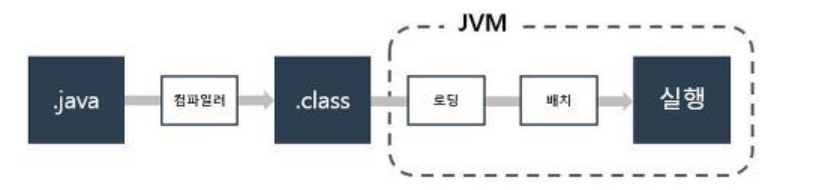

# JAVA

---

## 자바의  특징
### 1. 객체지향 언어이다
> -  프로그램을 개발하는 기법 중 하나로 객체들을 하나씩 먼저 만들고 나중에 이를 조립 및 연결하여 전체 프로그램을 완성하는 것
> - 객체를 만들기 위한 설계도인 `클래스`를 만들고, 이 설계된 객체를 연결하여 프로그램을 만들어낸다
> - 캡슐성, 다형성, 상속성 지원

 

### 2. 이식성이 높다
> - 이식성이란 서로 다른 실행환경을 가진 시스템간 프로그램을 옮겨 실행할 수 있는 것을 의미한다
> - 자바는 자바 실행환경(`JRE`)가 갖춰져 있는 모든 환경에서 실행이 가능하다

 

### 3. 메모리를 자동으로 관리한다
>- 자바는 메모리에 개발자가 직접적으로 접근할 수 없고 자바가 직접 관리한다
>- 객체 생성시 자동으로 메모리를 할당하고 사용이 완료되면 `Garbage Collector`를 실행시켜 실행하지 않는 객체를 자동으로 제거한다

 

---

# 자바의 동작 과정

1. JAVA 언어로 프로그래밍된 프로그래밍 `파일(.java)`을 컴파일러가 읽는다.
2. 컴파일러를 통해 바이트 코드로 작성된 JAVA `클래스(.class)` 파일로 만든다.
3. 이후 클래스 파일을 `JVM`이 읽고 실행하게 된다.

 

## JVM이란?
> Java Virtual Machine의 약자로, 자바 프로그램을 운영체제와 하드웨어에 관계없이 어디서든 실행 가능하게 만들어주는 자바의 가상머신

 

---

# 패키지

> `클래스`와 `인터페이스`를 구조화하고 관리하기 위한 그룹화 단위  
> 점(`.`)으로 구분된 일련의 구조를 가지며, 일반적으로 도메인 이름을 역순으로 사용하는 패키지 구조를 띄고 있다.

 

---

# 객체

> 사람, 자, 책 같은 물리적인 것이나 무형적인 것들  
> 자바에서는 클래스에서 생성된 데이터를 객체라고 부름

 

## 클래스
> 객체를 만들기 위한 설계도 or 틀  
> 상태를 나타내는 필드와 객체의 행동을 나타내는 메소드로 구성

