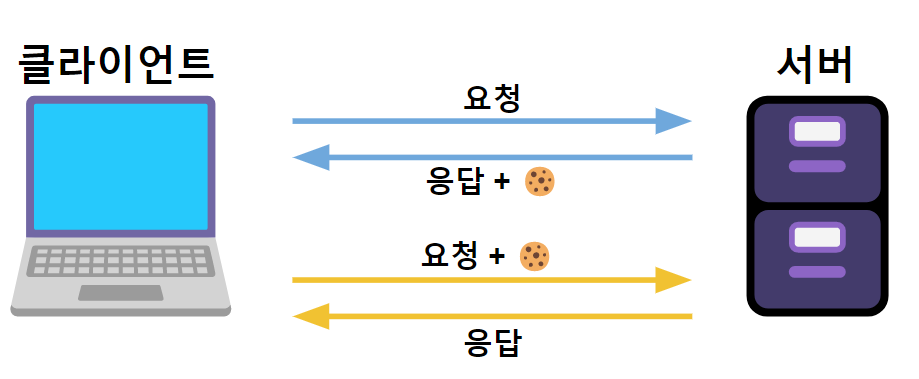

# REST API

---
> REST API는 프로그램과 또 다른 프로그램을 이어주는 일종의 다리

## API
    운영체제나 프로그래밍 언어가 제공하는 기능을 제어할 수 있게 만든 인터페이스

## REST
    - HTTP를 잘 사용하기 위한 아키텍쳐 스타일
    - URI를 통해 자원(URI)를 명시하고, HTTP METHOD(GET, POST, PUT, DELETE)를 통해 자원에 대한 CRUD를 처리하는 아키텍처
> 아키텍처 - 서비스의 동작 원리

 

## REST API
    REST한 방식으로 설계된 API
    HTTP를 잘 사용하기 위해 URL로 어떤 자원에 접근할 것인지, 메소드로 어떤 행위를 할 것인지 표현하여 설계된 API

- 클라이언트와 서버간 종속적이지 않음
- 즉, 서버는 클라이언트의 정보를 저장하고 있지 않는다.
- 같은 사람이 같은 정보를 보내도 서버는 정보를 유지하지 않기 때문에 새로운 값으로 받아들인다.

### 장점
1. 보기 깔끔하다.
    - URL만 보고도 어떤 행위를 할지 명확하게 알기 때문에 개발할때 보기 좋음

2. 리소스를 아낄 수 있다.
    - 1개의 URI로 4개의 행위(CRUD)를 명시할 수 있기 때문에 효율적임

3. 무상태성을 유지할 수 있다.
    - REST API의 가장 큰 특징으로 다양한 환경에서 통신이 가능하도록 도와준다.

 

---

## URL과 URI의 차이

---

### URI
- 일정한 규칙을 따르는 자원의 `식별자`
- 인터넷 우편물 주소 같은 개념
- 우리가 흔히 URL이라 부르는 주소값들은 사실 대부분이 URI

### URL
- 한 리소스에 대한 구체적인 `위치`를 서술한다.
- URL을 3가지로 구성되어있다.
    1. 스키마 : 리소스에 접근하기 위해 사용되는 프로토콜(https://)
    2. 주소 : velog.io
  3. 리소스 : @bbbbooo

 

---

## 쿠키와 세션

### 쿠키란?
    - 서버에서 클라이언트의 데이터를 저장하는 하나의 방법(로컬에 저장됨!!)
    - 클라이언트에 저장되는 키(key)와 값(value)가 들어있는 작은 파일
    - 사용자가 따로 요청하지 않아도 브라우저가 요청 시 Request Header에 넣어 자동으로 서버에 전송한다.

 

**쿠키의 작동 방식**

1. 클라이언트가 로그인 정보를 담아 서버에 요청을 보낸다.
2. 서버는 요청을 수행하고 응답을 보낼때, 로그인 정보가 담긴 쿠키를 만들어 클라이언트에게 Set-cookie같은 응답 헤더에 보내준다.
3. 브라우저는 서버로부터 받은 쿠키를 저장해두었다가 클라이언트가 다음 요청을 보낼때 자동으로 쿠키를 서버에 전송한다. 
4. 서버는 요청이 들어있는 쿠키를 읽어 클라이언트를 파악 후 응답한다.

    ex) 로그인 자동완성, 공지 하루 안보기, 쇼핑몰 사이트 로그인 안 한 상태에서 장바구니 담기

> 브라우저 -> 서버로의 쿠키 전송은 자동으로 진행이 되지만 서버 -> 브라우저는 개발자 본인이 직접 코드를 만들어야한다.

 

### 세션이란?
    - 쿠키를 기반으로 하고 있으며 쿠키가 로컬에서 저장되는 데이터라면 세션은 서버에서 저장되는 데이터다.
    - 클라이언트를 구분하기 위해 Session id를 부여한다.
    - 브라우저가 서버에 접속해 접속을 종료할때까지 인증 상태를 유지한다. (stateful)

 

**세션의 동작 방식**
1. 클라이언트가 서버에 요청을 보내면 서버는 쿠키에 `Session id`를 담아 반환한다.
2. 클라이언트가 서버에 새 요청을 보내면 브라우저는 자동으로 쿠키를 보내고 서버는 쿠키에 담긴 `Session id`를 확인해 요청을 수행한다.

---

## 무상태성과 무연결성

---

### 무상태성
- 서버가 클라이언트에 값을 저장하지 않음
- 클라이언트에 대한 응답만을 해줌
- 서버를 무한 확장시켜 고객이나 트래픽이 갑자기 폭주해도 서버를 추가하기 쉽다.
- 만약에 stateful 하다면, 여러 서버중 한 개의 서버가 장애가 났을 때 그 서버와 연결된 모든 클라이언트에서 오류가 난다.
- 만약에 stateless 하다면, 여러 서버 중 한 개의 서버가 장애가 나도 클라이언트에만 정보를 보관하기 때문에 다른 서버에서 요청을 처리할 수 있다.
- 클라이언트가 서버에 요청하는 정보가 늘어날 수 있기 때문에 모든 요청/응답을 무상태성으로 처리하지 않는다.

### 무연결성
- 서버와 클라이언트는 기본적으로 연결되어있지 않음
- 클라이언트의 요청이 있을때만 서버가 응답을 해줌
- 응답이 완료되면 서버의 연결이 끊어짐

 

---
## 세션 인증 방식과 토큰 인증 방식

### 세션 인증 방식
- 기본적인 흐름은 세션과 동일하다.
- 세션의 흐름 중 마지막에 `Session id`가 서버 메모리에 올라온 `Session id`와 일치하다면 허가를 내주는 인증 방식
- 관리가 편하고 효율적이다.
- 사용자가 많아지는 경우 로드 밸런싱을 통해 서버 확장을 해야되는데 이때 서버가 여러개로 나뉘기 때문에 세션 관리가 힘들다.

 

> 로드 밸런싱   
> 서버에 가해지는 부하(=로드)를 분산(=밸런싱) 해주는 장치 또는 기술

### 토큰 인증 방식
- 유저의 정보가 서버에 저장되지 않고 토큰이라는 형태로 정보를 전달하는 방식
- 유저의 정보가 유효하다면 서버는 유저에게 토큰을 발급한다.
- 클라이언트는 토큰을 저장하고 서버에 요청을 보낼때마다 토큰을 함께 보낸다.
- 서버는 토큰을 검증하고 유효하다면 응답한다.

